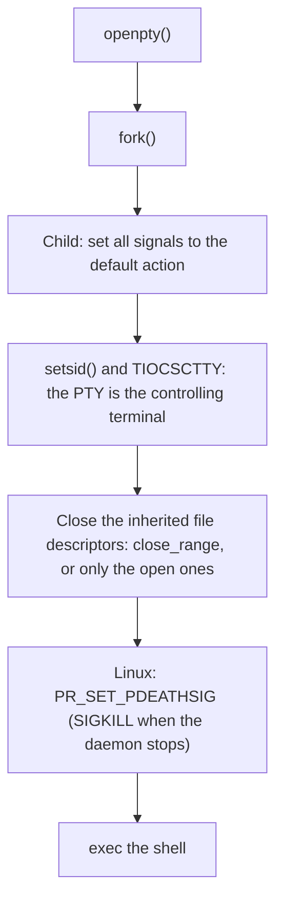
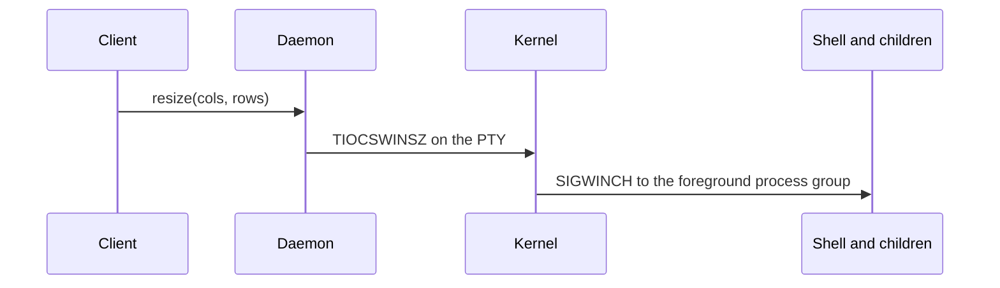
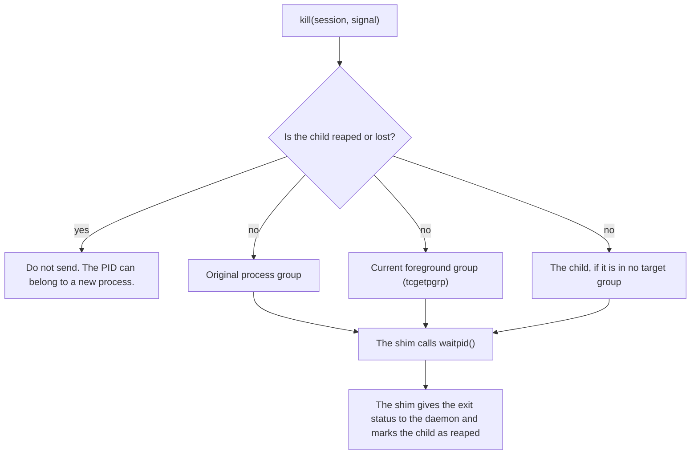

# PTY sessions in the daemon (2.8.0)

This document tells how the daemon runs terminal (PTY) sessions in 2.8.0. It also tells how 2.8.0 is different from 2.7.6.

## Summary

| Version | PTY engine |
|---|---|
| 2.7.6 | The PTY in Bun: `new Bun.Terminal()` and `Bun.spawn({ terminal })`. |
| 2.8.0 | A POSIX shim in header-free C: `src/pty-native/pty.c`. TinyCC compiles the shim at runtime through `bun:ffi`. Bun FFI loads it. There is no native addon and no build step. |

## Start a session

In 2.7.6 the shell does not get the PTY as its controlling terminal (`ps` shows `TTY ??`). The child also shares the process group of the daemon.

In 2.8.0 the child makes a new session and takes the PTY as its controlling terminal before `exec`.

The child does these steps:

1. Set all signals to the default action. A daemon that started under `nohup` does not give an ignored SIGHUP to the shell.
2. Make a new session and take the PTY as the controlling terminal.
3. Close the inherited file descriptors. On kernels without `close_range`, close only the file descriptors that are open.
4. On Linux, set `PR_SET_PDEATHSIG`. If the daemon stops, the kernel sends SIGKILL to the child.
5. Start the shell with `exec`.

The child does no libc copy between `fork` and `exec`.

## Resize the window

A text UI draws again only when it gets SIGWINCH.

| Version | Resize |
|---|---|
| 2.7.6 | The kernel does not send SIGWINCH, because the shell has no controlling terminal. The daemon finds each process in the tree and sends SIGWINCH to each one. |
| 2.8.0 | The daemon sets the size with `TIOCSWINSZ`. The kernel sends SIGWINCH to the foreground process group. |

## Stop a session

The shim reaps the child itself. It keeps two states: "reaped" and "lost". It does not send a signal to a PID in one of these states.

## Read and write

| Item | Behaviour |
|---|---|
| Read | The daemon reads with `poll`. Each turn has a budget of 1 MiB. |
| Transient read error | The turn stops. The daemon does not go into a busy loop. |
| Write overflow | The write stops with a specific error (`NativePtyWriteOverflowError`). |

## Platforms and backend selection

| Item | Value |
|---|---|
| Stable release targets in 2.8.0 | `darwin-arm64`, `darwin-x64-baseline`, `linux-x64-baseline`, `linux-arm64` |
| Prerelease targets in 2.8.0 | `darwin-arm64`, `darwin-x64-baseline`, `linux-x64-baseline`, `linux-arm64`, `win32-x64` |
| Other platforms | The shim stops with an error. |
| Windows | The ConPTY code (`src/pty-native/pty-win.c`) is in the tree. The `win32-x64` build ships in 2.8.0 prereleases as a preview. The PTY status stays `unavailable-until-phase3`: no ConPTY claim in this release. A supported Windows stable release is 2.8.1 work. |
| Backend variable | `OPENLLM_PTY_BACKEND`. The default on POSIX is `native`. The daemon stops with an error for an unknown value. |

## Where the code is

| Path | Content |
|---|---|
| `packages/daemon/src/pty-native/` | The C shim (`pty.c`), the FFI bindings (`ffi.ts`) and the compiler options (`cc-options.ts`). Only the daemon uses it. |
| `packages/daemon/src/native-pty.ts` | The daemon side: spawn, read turns, write, resize, kill and destroy. |
| `packages/tunnel/session/` | The session runtime that the CLI and the daemon share. It is not in the `tunnel` index. The browser does not load it. |
| `packages/tunnel/update-lock.ts` | The self-update lock that the CLI and the daemon share. |

## Tests

| Test area | Files (examples) |
|---|---|
| ABI and loader | `tests/daemon/pty-loader-boundary.test.ts`, `tests/daemon/pty-shim-golden.test.ts` |
| File descriptors | `tests/daemon/pty-fd-hole.test.ts`, `tests/daemon/pty-close-fallback.test.ts` |
| Signals | `tests/daemon/pty-signals.test.ts`, `tests/daemon/pty-child-signal-reset.test.ts` |
| Faults and stress | `tests/daemon/pty-poll-fault.test.ts`, `tests/daemon/pty-shim-fault.test.ts`, `tests/daemon/pty-shim-stress.test.ts` |
| Lifecycle | `tests/daemon/pty-lifecycle.test.ts`, `tests/daemon/pty-session-e2e.test.ts` |

Results for 2.8.0-beta.1: 205 of 205 on macOS 27 (arm64) and 202 of 202 on Linux x64, two runs each.
